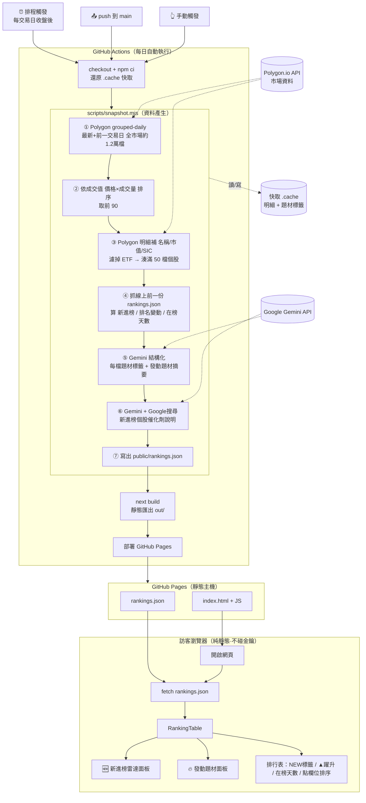
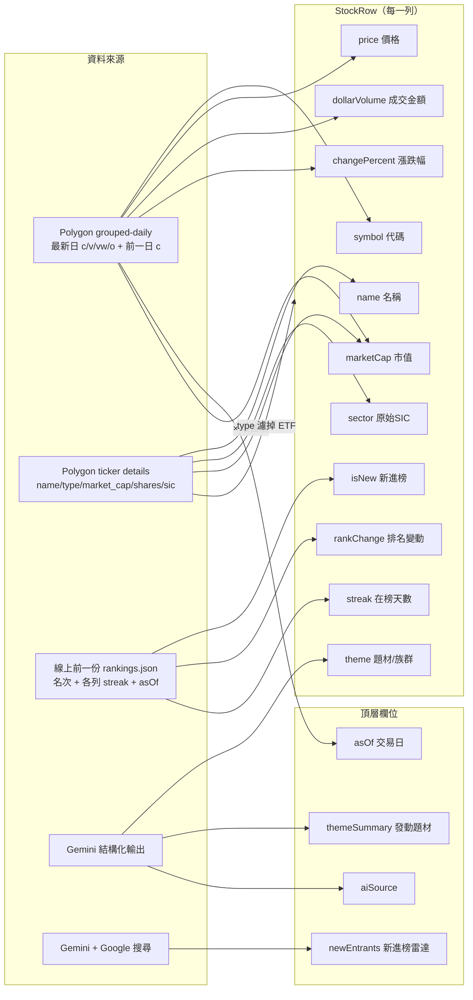
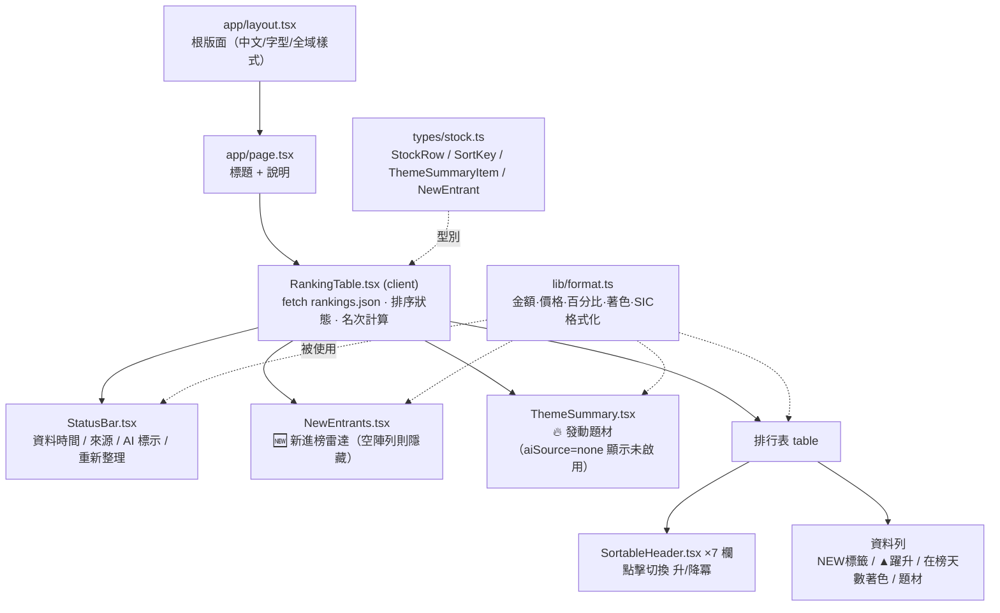

# 系統架構文件

美股成交值排行 Top 50 —— 純靜態網站 + 每日 AI 快照。

核心設計：**所有重活（抓資料、排序、AI 分析）集中在每日一次的 GitHub Action**，產物是一份靜態 `rankings.json`；**訪客端只讀這份靜態檔**，不呼叫任何 API、不需金鑰、沒有伺服器 → 零成本、不被速率限制、不易壞。

---

## 1. 整體架構流程圖

**重點**
- 建置期金鑰：`POLYGON_API_KEY`、`GEMINI_API_KEY`（GitHub Secrets，只存在 CI）。
- `.cache`（明細與題材標籤）以 actions/cache 跨執行保留，降低 API 呼叫。
- 排程 `0 2 * * 2-6`（UTC，美股收盤後，週二至週六）；push / 手動也會觸發。

---

## 2. 資料欄位流向圖

每個欄位是怎麼算出來的、來自哪個來源。

**算法重點**
- `dollarVolume`（成交金額）= 均價 `vw` × 成交量 `v`；排序依據。
- `changePercent` = (最新收盤 − 前一日收盤) / 前一日收盤。
- `marketCap` = 流通股數 × 最新收盤（無股數則用 Polygon `market_cap`）；ETF 無市值。
- `theme` 優先序：Gemini → `.cache` 內題材（30 天 TTL）→ SIC 格式化字串（後備）。
- `isNew` / `rankChange` / `streak` 皆與「線上前一份快照」比對；同一交易日重跑不累加 streak。
- 缺 `GEMINI_API_KEY` 或呼叫失敗 → `aiSource="none"`、`theme` 退回 SIC、`themeSummary`/`newEntrants` 為空。

---

## 3. 前端元件樹

**重點**
- 整個前端只有一處抓資料：`RankingTable` 載入時 `fetch('rankings.json')`（相對路徑，相容 GitHub Pages 子路徑）。
- 排序全在前端（對已載入的 50 列），即時無延遲；`#` 名次固定代表「成交值排名」，與當前排序無關。
- 著色慣例（漲綠跌紅 / 台股漲紅跌綠）集中在 `lib/format.ts` 的 `COLOR_CONVENTION` 常數。

---

## 檔案地圖

| 路徑 | 角色 |
|------|------|
| `scripts/snapshot.mjs` | **資料引擎**：抓 Polygon + Gemini 分析 → 產 `public/rankings.json` |
| `scripts/prewarm.mjs` | 預熱明細快取（選用） |
| `.github/workflows/deploy.yml` | 每日排程 + 建置 + 部署 Pages |
| `src/app/{layout,page}.tsx`、`globals.css` | 頁面外殼 |
| `src/components/RankingTable.tsx` | 主表格（抓資料、排序、標示） |
| `src/components/{NewEntrants,ThemeSummary,StatusBar,SortableHeader}.tsx` | 面板與表頭 |
| `src/lib/format.ts` | 格式化與著色工具 |
| `src/types/stock.ts` | 前端共用型別（自足） |
| `public/rankings.json` | 每日資料快照（CI 產生、靜態提供） |
| `src/lib/providers/*`、`src/lib/rankings.ts` | 早期 server 模式的資料層（靜態版未使用，保留供未來 server 部署參考） |

> 部署與金鑰設定見 [DEPLOY.md](DEPLOY.md)。
